# Single Bet Placement — QA Bug Report

**App under test:** https://qae-assignment-tau.vercel.app/?user-id=candidate-LfzI2CKDRw
**Feature:** Single Bet Placement
**Tester:** Piotr
**Date:** 2026-06-18

---

## Bugs (ordered by severity)

### BUG-01 — Negative stake accepted by `/api/place-bet`, returns HTTP 200
**Severity:** Critical

**Reproduction Steps:**
1. Send a `POST` request directly to `/api/place-bet` with a `stake` value below 1, e.g. `-1`, for a valid match/selection (e.g. `matchId: "premier-league-manutd-chelsea"`, `selection: "HOME"`, `odds: 2.45`).
2. Observe the response.

**Expected vs Actual:**
- Actual: API returns `200 OK` with body confirming the bet, including a negative payout: `{"message":"Bet placed successfully","matchId":"premier-league-manutd-chelsea","selection":"HOME","stake":-1,"odds":2.45,"payout":-2.46,"balance":43,"currency":"USD"}`.
- Expected: request rejected with a 4xx error (stake must a number between 1 to 100).

**Business Impact:** Direct exploit path to corrupt balances/ledgers or manipulate payout records; in a real-money betting product this is a financial integrity and potential fraud vulnerability.

**Evidence:** 

---

### BUG-02 — Bets can be placed while balance is below zero
**Severity:** Critical

**Reproduction Steps:**
1. Get account balance into a negative state (ex. by repeated betting).
2. Attempt to place another bet (via UI or directly via `/api/place-bet`).

**Expected vs Actual:**
- Actual: further bets are accepted with no balance guard.
- Expected: betting blocked once balance is insufficient/negative.

**Business Impact:** Allows unlimited betting beyond available funds — direct financial exposure for the business and a regulatory/responsible-gambling concern.

**Evidence:** 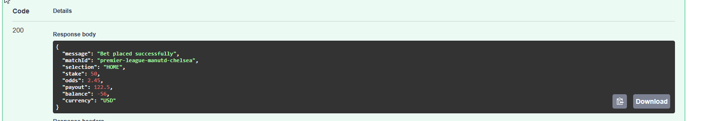

---

### BUG-03 — Past/finished matches remain open for betting
**Severity:** Critical

**Reproduction Steps:**
1. Open the app.
2. Note that every visible match is tagged **PAST** and shows no score (`-`), yet all three outcome odds (1 / X / 2) remain clickable.
3. Select an outcome on a PAST match (e.g. Manchester Utd vs Chelsea) and place a bet.

**Expected vs Actual:**
- Actual: PAST matches with no score are fully bettable, same as upcoming ones.
- Expected: matches that have already kicked off / concluded should not be open for new bets, or should at minimum show a result instead of "-".

**Business Impact:** Users (or bad actors) could place bets on events whose outcome is already known or settled — a severe integrity/fraud risk and direct financial liability.

**Evidence:** 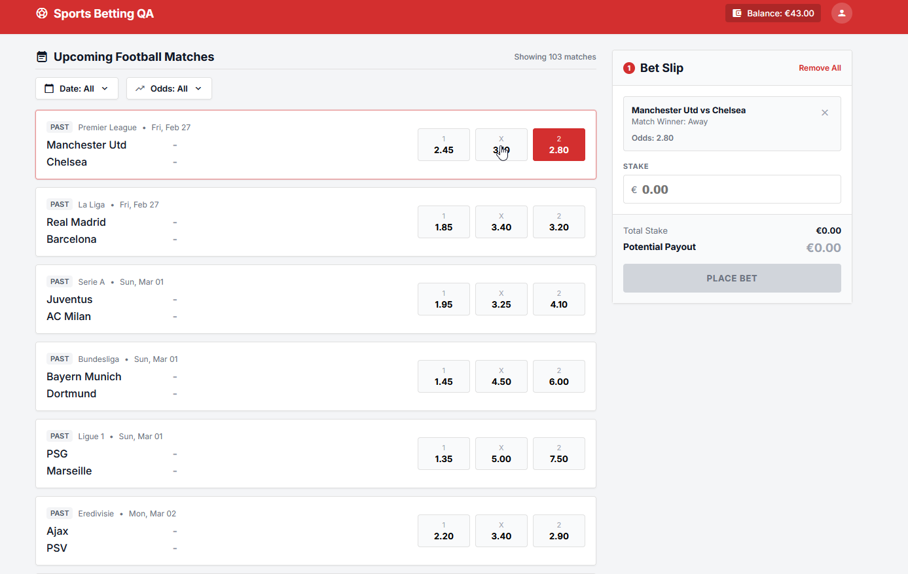

---

### BUG-04 — Balance does not update live after placing a bet; frontend keeps allowing further bets
**Severity:** Critical

**Reproduction Steps:**
1. Note current balance in header (Screenshot A/B: €43.00).
2. Place a bet successfully.
3. Observe header balance — it stays unchanged until the page is manually refreshed.
4. Without refreshing, attempt to place another bet.

**Expected vs Actual:**
- Actual: balance is stale until refresh, and frontend validation does not block additional bets based on the (stale) displayed balance.
- Expected: balance updates immediately after a successful bet, and the UI prevents further bets once funds are insufficient.

**Business Impact:** Users can over-commit funds beyond their real balance before the UI catches up, risking overdraft-style exposure and user confusion/disputes.

---

### BUG-05 — Potential payout in confirmation pop-up does not match Bet Slip (appears to always double the stake value)
**Severity:** High

**Reproduction Steps:**
1. Select an outcome, e.g. Manchester Utd vs Chelsea, Away @ 2.80 (Screenshot B).
2. Enter a stake and note the "Potential Payout" shown in the Bet Slip.
3. Place the bet and view the confirmation pop-up.
4. Compare the payout figure shown in the pop-up to the one shown in the Bet Slip before submission.

**Expected vs Actual:**
- Actual: pop-up payout is incorrect and appears to double the stake.
- Expected: confirmation pop-up payout matches the Bet Slip's calculated potential payout (stake × odds).

**Business Impact:** Showing an incorrect win amount is a serious trust and compliance issue in a betting product — it can mislead users about expected returns and create disputes over payout discrepancies.

**Evidence:** 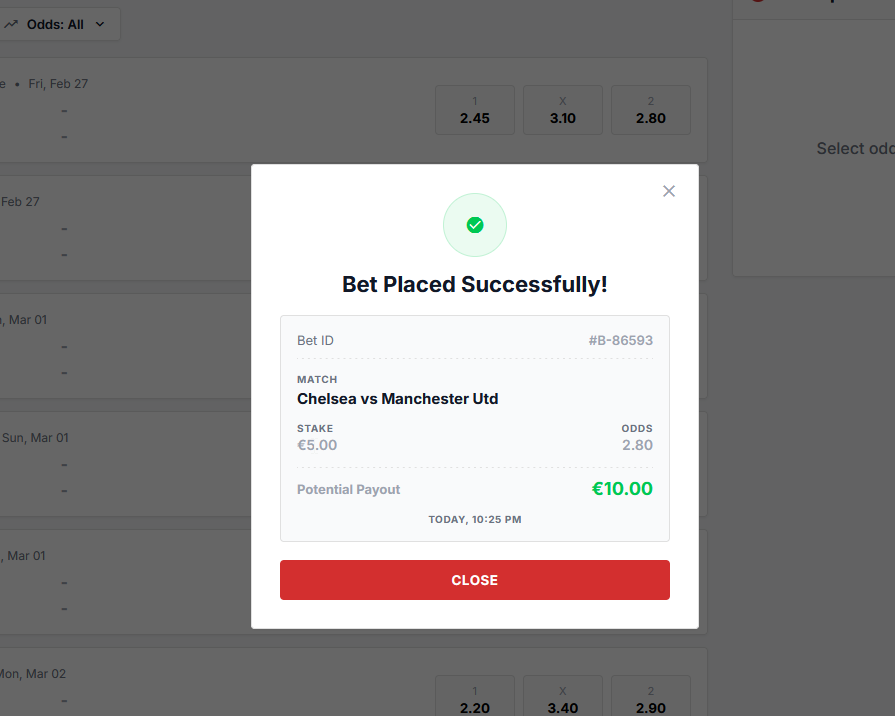

---

### BUG-06 — Balance API response is cacheable
**Severity:** High

**Reproduction Steps:**
1. Open the webpage with user-id in url
2. Refresh the page and inspect network response headers for the balance request made by the web app.
2. Check the response status (it's 304)

**Expected vs Actual:**
- Actual: the response is cacheable.
- Expected: balance is a small, frequently-changing, high-importance value and should be served as non-cacheable (e.g. `Cache-Control: no-store`).

**Business Impact:** A cached/stale balance can be displayed to the user, which in a betting context risks users misjudging available funds and over-betting; the low request cost does not offset the trust risk of showing a wrong balance.

**Evidence:** 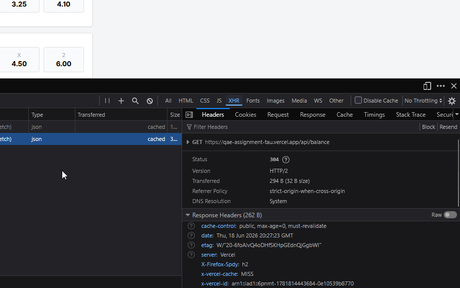

---

### BUG-07 — Invalid currency field.
**Severity:** High

**Reproduction Steps:**
1. Place a bet via the UI or `POST /api/place-bet`.
2. Inspect the request payload — note there is no `currency` field being sent.
3. Inspect the response — note the `currency` field returned (`"USD"`).

**Expected vs Actual:**
- Actual: `/api/place-bet` request body has no currency field, and the response currency (`USD`) is inconsistent with what's shown in the UI (€) and what /api/balance returns for the user.
- Expected: `currency` should be an explicit, validated part of the request (or otherwise reliably tied to the user's account currency), and the response currency should reflect the actual account/display currency (UI elsewhere shows €).

**Business Impact:** Currency mismatches in financial transactions are a serious correctness/compliance issue, especially if the platform supports multiple currencies or markets.

**Evidence:** UI: 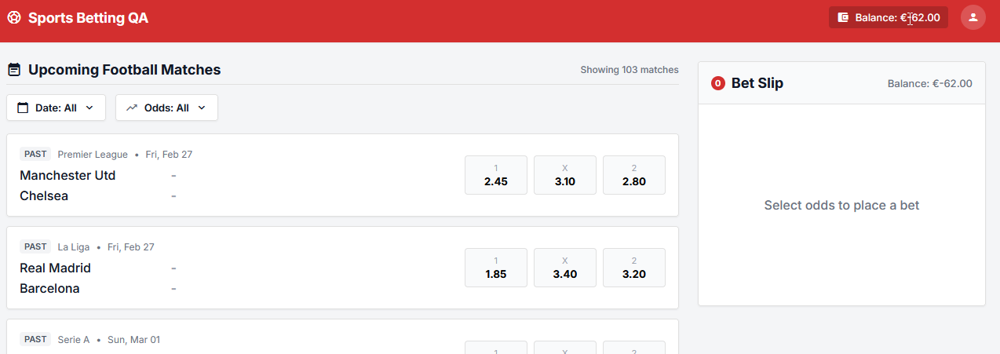 API: 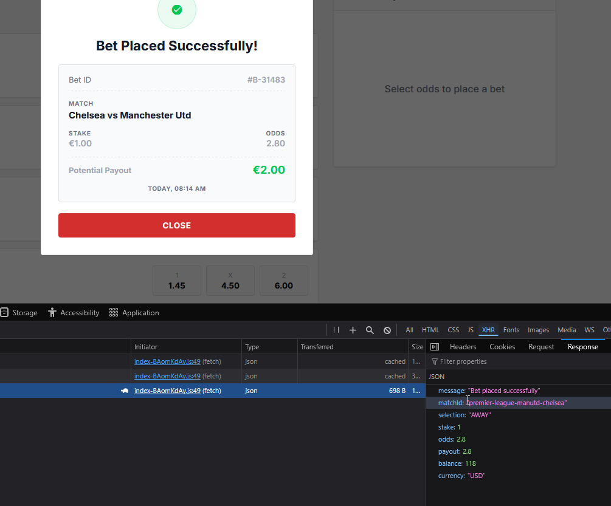

---

### BUG-08 — Inconsistent HTTP method guarding: `GET /api/place-bet` is not blocked, while `GET /api/reset-balance` is
**Severity:** High

**Reproduction Steps:**
1. Send a `GET` request to `/api/place-bet`.
2. Send a `GET` request to `/api/reset-balance`.
3. Compare responses.

**Expected vs Actual:**
- Actual: `GET /api/reset-balance` correctly returns `method_not_allowed`, but `GET /api/place-bet` is not guarded the same way.
- Expected: both action endpoints should consistently reject non-POST methods (e.g. `405 method_not_allowed`).

**Business Impact:** Inconsistent endpoint guarding suggests gaps in API hardening; an unguarded action endpoint increases the surface for accidental or malicious bet placement via simple GET requests (e.g. from crawlers, cached links, or GET-triggered CSRF-style attacks).

---

### BUG-09 — Same date matches are showing just a day not specific date
**Severity:** High

**Reproduction Steps:**
1. Locate the match that is held same week as current.
2. Observe the displayed date — shows only day ex. "Saturday" or "Tomorrow" if it's tomorrow with no calendar date (See test evidence).
3. Inspect the underlying API payload for this match: `{"id":"mls-inter-miami-lafc-2026-06-20","competition":"MLS","kickoffDate":"2026-06-20","homeTeam":"Inter Miami","awayTeam":"LAFC","odds":{"home":2.65,"draw":3.45,"away":2.45}}` — a full date is present.

**Expected vs Actual:**
- Actual: only the weekday name "Saturday" is shown, with no date, for this specific match.
- Expected: exact date should be rendered the same way as for all other matches, since the data is available.

Note from debugging: this is handled directly within js code rules.

**Business Impact:** Users cannot reliably tell when this fixture takes place, increasing the risk of betting on or missing an event due to ambiguous timing — directly relevant to correct bet placement.

**Evidence:** 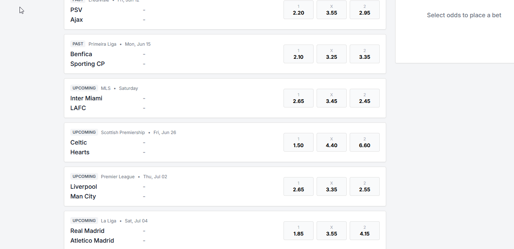 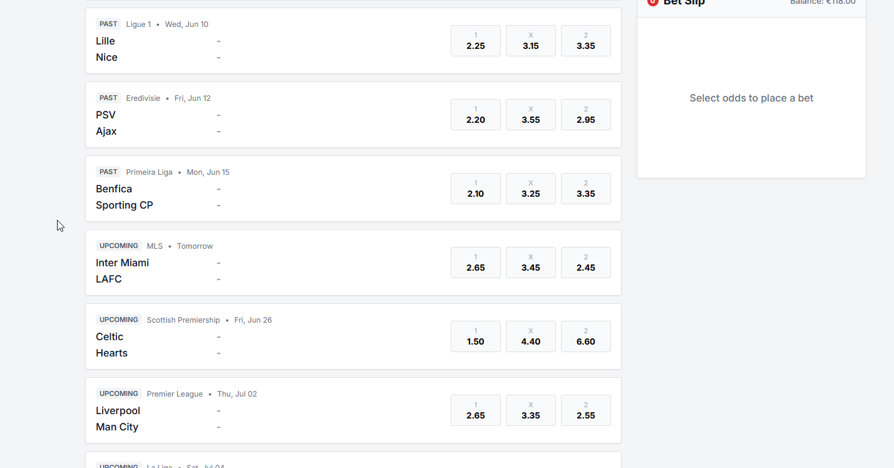
---

### BUG-10 — Home/Away team order in confirmation pop-up is swapped relative to the match list and Bet Slip
**Severity:** Medium

**Reproduction Steps:**
1. Select a stake on a listed match, e.g. Manchester Utd vs Chelsea 
2. Place the bet and open the confirmation pop-up.
3. Compare the team order shown in the pop-up to the order shown in the match list / Bet Slip.

**Expected vs Actual:**
- Actual: the order is reversed in the confirmation pop-up.
- Expected: home/away order in the confirmation pop-up matches the order shown in the match list and Bet Slip.

**Business Impact:** Could cause users to believe they bet on the wrong fixture or wrong side, leading to support disputes and reduced trust in bet confirmations.

**Evidence:** 

---

### BUG-11 — Match list is not consistently sorted by date
**Severity:** Medium

**Reproduction Steps:**
1. Open the match list (Screenshot A).
2. Scroll through the list and note the date sequence.

**Expected vs Actual:**
- Actual: dates appear out of order — February, then March, then February again, then March/February again.
- Expected: matches sorted consistently (e.g. chronologically ascending) by kickoff date.

**Business Impact:** Confusing browsing experience; makes it harder for users to find and bet on matches in a predictable order, especially for time-sensitive bets.

**Evidence:** 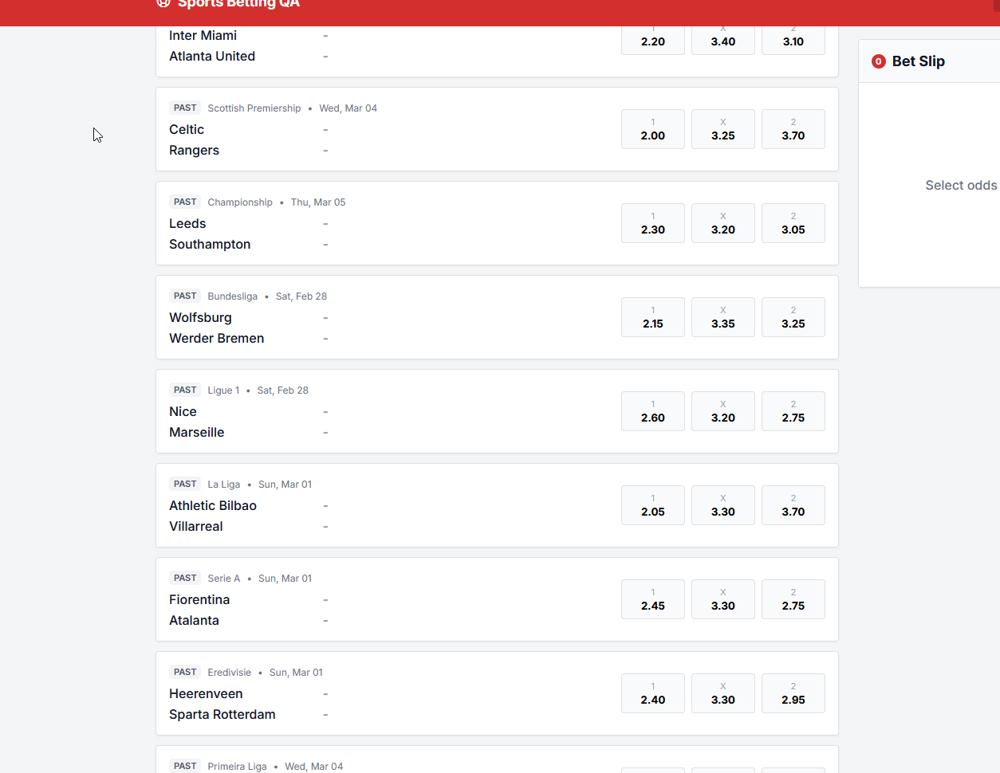

---

### BUG-12 — Setting min odd filter equal to a visible match's home odd removes that match from the list
**Severity:** Medium

**Reproduction Steps:**
1. Note the home odd of the first listed match, e.g. Manchester Utd vs Chelsea, home odd 2.45 .
2. Open the Odds filter dropdown.
3. Set the minimum odd to 2.45 (the exact home odd value from step 1) and apply.

**Expected vs Actual:**
- Actual: the match disappears from the list, along with every other match whose home odd is exactly 2.45.
- Expected: the match (and any other match with home odd exactly 2.45) should remain visible, since 2.45 ≥ min filter of 2.45.

**Business Impact:** Similar root-cause family as BUG-13 (exclusive boundary handling); causes users to lose visibility of matches that should match their search criteria.

---

### BUG-13 — No kickoff time shown on the matches list (Requirement 2.1)
**Severity:** Medium

**Reproduction Steps:**
1. Open the match list (Screenshot A).
2. Review the date label shown for each match (e.g. "Fri, Feb 27").

**Expected vs Actual:**
- Actual: only the date is shown; no kickoff time is displayed anywhere in the list.
- Expected (per requirement 2.1): match listing should include time, not just date.

**Business Impact:** Users cannot tell what time a match starts, which is important information for deciding when/whether to place a bet before kickoff.

**Evidence:** 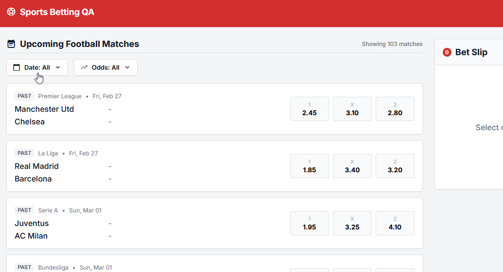

---

### BUG-14 — Odds filter allows max value lower than min value
**Severity:** Low

**Reproduction Steps:**
1. Open the Odds filter.
2. Enter a minimum value, e.g. 3.00.
3. Enter a maximum value lower than the minimum, e.g. 2.00.
4. Apply the filter.

**Expected vs Actual:**
- Actual: the invalid range is accepted with no validation, typically resulting in a confusing empty result set.
- Expected: the UI should prevent or auto-correct an invalid range (max < min), e.g. by disabling Apply or showing a validation message.

**Business Impact:** Leads to a confusing "no results" experience with no explanation, increasing user frustration and support queries.

**Evidence:** 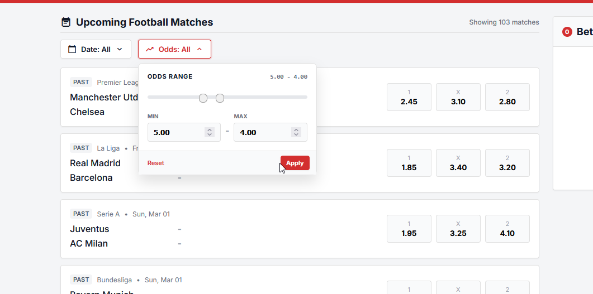

---

### BUG-15 — Match counter ("Showing 103 matches") does not update after filtering
**Severity:** Low

**Reproduction Steps:**
1. Open the match list — note the counter "Showing 103 matches" (Screenshot A).
2. Apply any filter (Date or Odds) that reduces the visible match count.
3. Observe the counter value.

**Expected vs Actual:**
- Actual: counter remains fixed at "Showing 103 matches" regardless of applied filters.
- Expected: counter reflects the number of matches currently visible after filtering.

**Business Impact:** Misleading UI copy undermines user confidence in the filtering feature and the accuracy of the displayed data.

**Evidence:** 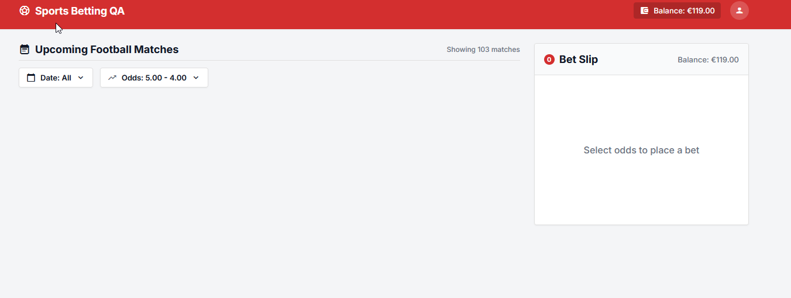

---

### BUG-16 — Error pop-up disappears too quickly to allow the user to act on it
**Severity:** Medium

**Reproduction Steps:**
1. Trigger a bet placement error by multiply clicking the "Place bet" button.
2. Observe the error pop-up.
3. Attempt to read it and retry ("rebet") before it disappears.

**Expected vs Actual:**
- Actual: the pop-up auto-dismisses very quickly, preventing the user from reading it fully or reacting (e.g. correcting the stake and resubmitting).
- Expected: Error pop-up should allow user the interaction with it and present the message

**Business Impact:** Users may not understand why their bet failed and may abandon the flow or retry blindly, hurting conversion and increasing support load.

**Evidence:** 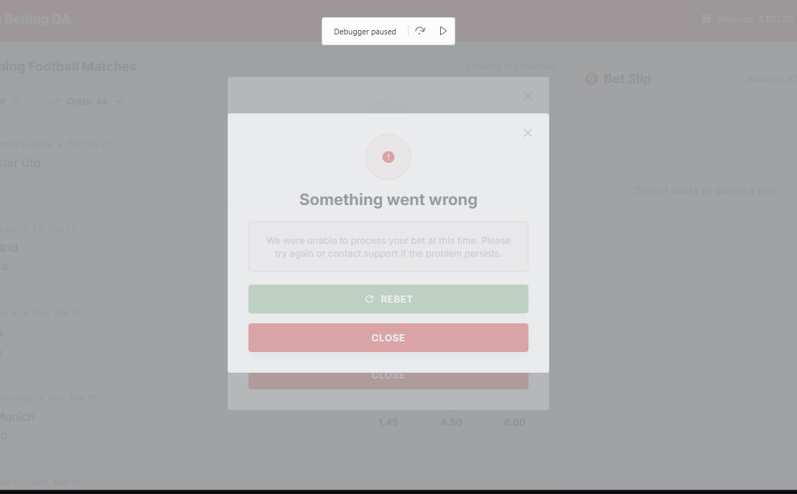

---

### BUG-17 — No available balance shown in the Bet Slip once a selection is made (Requirement 2.2)
**Severity:** Medium

**Reproduction Steps:**
1. Open the app — note balance is visible in the header and in the empty Bet Slip ("Select odds to place a bet", Balance €43.00 — Screenshot A).
2. Select an outcome, e.g. Manchester Utd vs Chelsea, Away (Screenshot B).
3. Observe the Bet Slip panel — the balance display has been replaced by the "Remove All" link.

**Expected vs Actual:**
- Actual: once a selection is made, the balance in the Bet Slip is replaced by "Remove All", and balance is only visible in the header.
- Expected (per requirement 2.2): available balance should remain visible in the Bet Slip while placing a bet.

**Business Impact:** Reduces visibility of available funds at the exact moment the user is deciding how much to stake, which can lead to attempted overstaking and a worse betting decision-making experience.

**Evidence:** Screenshot B (Bet Slip header shows "Remove All" instead of balance)

### BUG-18 — Odds range filter is exclusive instead of inclusive at the minimum boundary (violates requirement 2.9)
**Severity:** Low

**Reproduction Steps:**
1. Set min odd filter to 2.09 and max to 2.14.
2. Observe 4 matches are shown, each with a home odd of 2.10.
3. Change min filter to 2.10 (same value as the matches' home odd) and re-apply.
4. Observe all matches disappear.

**Expected vs Actual:**
- Expected: per requirement 2.9, the odds range filter should be inclusive — a match with an odd exactly equal to the min (or max) boundary should remain visible.
- Actual: setting min to the exact odd value excludes all matching records, indicating the filter is implemented as exclusive (`>`) rather than inclusive (`>=`).

**Business Impact:** Users filtering for a specific odds value get zero results even though matching odds exist, undermining the filter's usefulness and violating a documented requirement.

---

### BUG-19 — Date picker shows a red "error" highlight when only a Start Date is selected, despite working correctly
**Severity:** Low

**Reproduction Steps:**
1. Open the Date filter.
2. Select only a Start Date (no End Date).
3. Observe the Start Date field is highlighted in red, as if invalid.
4. Click Apply anyway.
5. Separately, set Start Date and End Date to the same day and apply.

**Expected vs Actual:**
- Expected: if selecting only a Start Date is a valid, supported way to filter for a single day (as confirmed by step 5 producing the same result), the UI should not present it as an error state.
- Actual: the field is highlighted red as though invalid, even though Apply works and produces the expected single-day filter result.

**Business Impact:** Misleading validation styling can cause users to abandon a valid filtering action they assume is broken, slightly reducing engagement with the date filter.

**Evidence:** [Attach screenshot of red-highlighted Start Date field here]

---

## Note for Discussion (not a bug — flagging for team review)

**Match ID format/uniqueness risk:** Match `id` values are currently plain strings without an embedded date for some matches (e.g. `"premier-league-manutd-chelsea"`), while others include the date (e.g. `"ligue-1-psg-lyon-2026-04-12"`). Without a guaranteed-unique, consistent ID scheme (e.g. always including date/season), there's a risk of ID collisions for repeat fixtures (e.g. the same two teams playing again in a later round/season). Recommend the team discuss a consistent ID strategy and update the API documentation accordingly. This is a separate comment, not scored as a bug.

---

## Improvement Suggestions

1. **API schema validation for odds:** add a constraint to the `/api/matches` schema so odds fields only accept positive numbers — e.g. `"exclusiveMinimum": 0` (JSON Schema 2020-12 style), or for OpenAPI 3.0, `"minimum": 0, "exclusiveMinimum": true`.

2. **Calendar "All" button UX:** selecting "All" in the date filter still shows the calendar picker at the same time, which is misleading (suggests a date still needs to be chosen). Consider hiding/collapsing the calendar when "All" is selected.

3. **Odds slider mouse interaction:** the odds range slider does not respond well to mouse drag interaction. Not currently covered by written requirements, so filed here as a UX improvement rather than a bug.

4. **Retain stake input across selections:** currently, switching the selected bet clears any stake the user had already typed. Consider preserving the entered stake value when the user changes their selection, to reduce repetitive re-entry.

---

## Severity Summary

| Severity | Count |
|---|---|
| Critical | 4 |
| High | 5 |
| Medium | 6 |
| Low | 4 |
| **Total bugs** | **19** |

